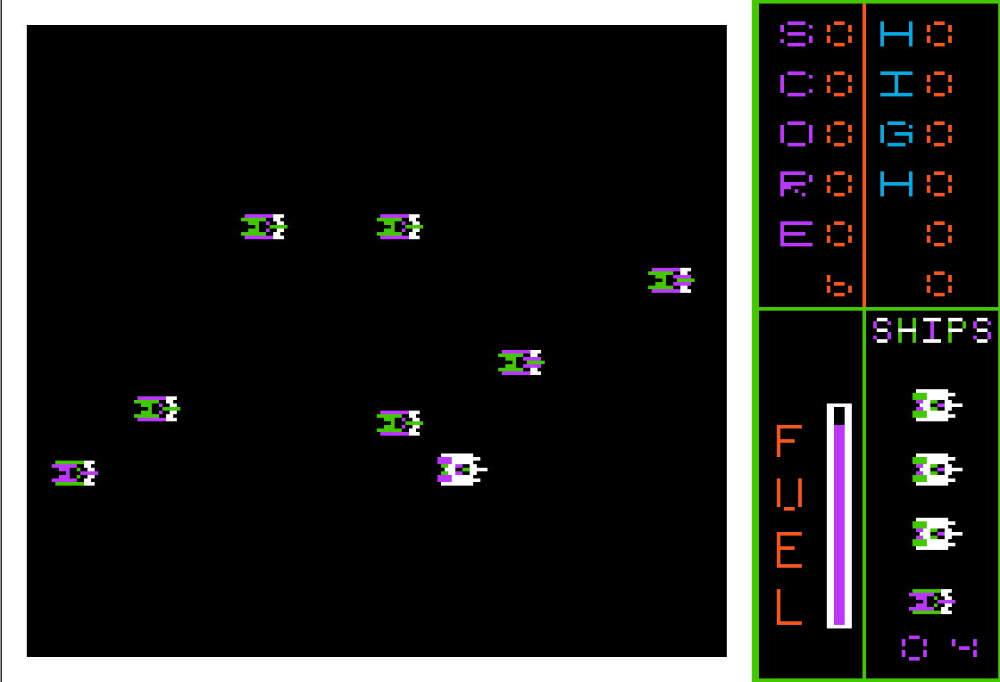

Totally
=======
|MIT| |APPLE| |Apple2TS| |Itch|

.. |MIT| image:: https://img.shields.io/badge/License-MIT-yellow.svg
   :target: https://opensource.org/licenses/MIT

.. |APPLE| image:: https://img.shields.io/badge/Apple%20II-ProDOS-0000C0.svg?logo=apple&logoColor=ee0000
   :target: https://github.com/AppleWin/AppleWin

.. |Itch| image:: https://img.shields.io/badge/Itch.io-fa5c5c.svg
   :target: https://myleftgoat.itch.io/totally

.. |Apple2TS| image:: https://img.shields.io/badge/apple2ts-blue.svg?logo=data:image/svg%2bxml;base64,PD94bWwgdmVyc2lvbj0iMS4wIiBlbmNvZGluZz0iVVRGLTgiPz4NCjxzdmcgaWQ9IkxheWVyXzEiIHhtbG5zPSJodHRwOi8vd3d3LnczLm9yZy8yMDAwL3N2ZyIgdmVyc2lvbj0iMS4xIiB2aWV3Qm94PSIwIDAgMjQuNSAyOC45Ij4NCiAgPCEtLSBHZW5lcmF0b3I6IEFkb2JlIElsbHVzdHJhdG9yIDMwLjAuMCwgU1ZHIEV4cG9ydCBQbHVnLUluIC4gU1ZHIFZlcnNpb246IDIuMS4xIEJ1aWxkIDEyMykgIC0tPg0KICA8ZGVmcz4NCiAgICA8c3R5bGU+DQogICAgICAuc3QwIHsNCiAgICAgICAgZmlsbDogI2U0MzgzOTsNCiAgICAgIH0NCg0KICAgICAgLnN0MSB7DQogICAgICAgIGZpbGw6ICMwMDlkZTA7DQogICAgICB9DQoNCiAgICAgIC5zdDIgew0KICAgICAgICBmaWxsOiAjZjg4MjAxOw0KICAgICAgfQ0KDQogICAgICAuc3QzIHsNCiAgICAgICAgZmlsbDogI2ZmMDsNCiAgICAgIH0NCg0KICAgICAgLnN0NCB7DQogICAgICAgIGZpbGw6ICNlMjM4Mzg7DQogICAgICB9DQoNCiAgICAgIC5zdDUgew0KICAgICAgICBmaWxsOiAjZTEzNzM4Ow0KICAgICAgfQ0KDQogICAgICAuc3Q2IHsNCiAgICAgICAgZmlsbDogIzllMzk5NTsNCiAgICAgIH0NCg0KICAgICAgLnN0NyB7DQogICAgICAgIGZpbGw6ICM1ZWJmM2Y7DQogICAgICB9DQoNCiAgICAgIC5zdDggew0KICAgICAgICBmaWxsOiAjZmViYTAxOw0KICAgICAgfQ0KICAgIDwvc3R5bGU+DQogIDwvZGVmcz4NCiAgPHBhdGggY2xhc3M9InN0NyIgZD0iTTE2LjIsMGMuOS41LjcsMS40LjcsMi4ycy40LjUuOC41Yy42LDAsMS4zLDAsMS42LjZzMCwxLDAsMS41aC04LjV2LTJjLjgsMCwxLjctLjIsMi42LS40Vi43Yy4zLS4yLjUtLjQuNy0uNmgyLjFaIi8+DQogIDxwYXRoIGNsYXNzPSJzdDEiIGQ9Ik0xOS4yLDI0LjF2My4yYzAsLjcsMCwxLjItLjksMS4ycy0uMi4xLS40LjJjLS4zLjEtLjUuMi0uNy4yaC0uMWMtLjItLjItLjQtLjQtLjYtLjQtLjUsMC0uNy0uMy0uNy0uOHYtMy41aDMuNFoiLz4NCiAgPHBhdGggY2xhc3M9InN0MiIgZD0iTTE2LjcsOS43di44aDJjLjUsMCwuNy4yLjYuNnYyaDQuOWMwLC42LjEsMS4xLjEsMS43aC01Ljh2LS45aC00LjNjMCwuMiwwLC41LS4xLjhoLTZjMC0xLjgtLjItMS45LDEuNy0xLjguMiwwLC4zLDAsLjYtLjEuMS0uNS4yLTEsLjEtMS41aC0zLjdzLS4yLjEtLjMuMmgwdjEuNWMwLC42LS4zLjktLjkuOWgtMS4yYy0uNy0uMS0uOS4yLTEsLjlILjF2LTEuMWMuMi0uNy43LS44LDEuNC0uOCwxLjIsMCwxLjEsMCwxLjItMS4xLDAtLjUuMy0xLC41LTEuNSwwLS4xLjMtLjIuNS0uMmgxLjNjMCwwLC4zLS4yLjUtLjRoMTEuMloiLz4NCiAgPHBhdGggY2xhc3M9InN0NiIgZD0iTTE2LjcsMTkuNWMwLC44LjMsMS4xLDEsMWguN2MuNiwwLC44LjMuOC44djNoLTMuM2MtLjQsMC0uOC0uMS0xLjMtLjItMS4xLDAtMS4zLS4yLTEuMy0xLjJzLS42LTEuNS0xLjgtMS40djIuNGMtLjgsMC0xLjUuMi0yLjMuMkgxLjljLTEuNCwwLTIuNC0xLjUtMS43LTIuOCwwLS4yLjItLjMuNS0uNC4zLDAsLjMsMCwuMywwaDYuNnMuMi0uMi4zLS4zYzAtLjMuMS0uNi4zLTFoOC42LDBaIi8+DQogIDxwYXRoIGNsYXNzPSJzdDgiIGQ9Ik0xNi43LDkuN0g1LjZjMC0uNiwwLTEuMS40LTEuN2g0LjJjLjUsMCwuNi0uMi42LS43di0yLjVoOC41djMuM2MwLC42LS4yLjgtLjguOGgtMS45di45aDBaIi8+DQogIDxwYXRoIGNsYXNzPSJzdDQiIGQ9Ik04LjIsMTQuNmg2YzAsLjguMSwxLjcsMCwyLjUsMCwuNy4yLjkuOS44aC41YzEsMCwxLjMuNiwxLjIsMS43aC04LjZ2LTVaIi8+DQogIDxwYXRoIGNsYXNzPSJzdDUiIGQ9Ik0wLDE0LjhoMy4zYzAsLjYsMCwxLjEtLjIsMS43LS45LDAtMS43LDAtMi41LS4xcS0uMi0uMS0uMy0uM2MwLS4yLDAsMCwwLDAsMC0uNC0uMi0uNy0uMy0xLjF2LS4yWiIvPg0KICA8cGF0aCBjbGFzcz0ic3QzIiBkPSJNMTAuMSw4aC00LjFjLjQsMCwuOS0uMSwxLjQtLjFoMi43WiIvPg0KICA8cGF0aCBjbGFzcz0ic3QwIiBkPSJNMTguNiwxNC44aDUuOGMuMiwxLjUsMCwxLjYtMS40LDEuNmgtMy4zYy0uNywwLTEuMS0uNC0xLjEtMS4xczAtLjMsMC0uNVoiLz4NCjwvc3ZnPg==
      :target: https://apple2ts.com

Overview
--------
This game was written as an experiment while in high school.  It was never
fully completed, but it reached a reasonably playable state in 1983. This 
version is a snapshot of that state.

It is a simple multi-level side shooter with a "boss" between levels.
It can be played with keyboard or joystick, but a joystick is strongly 
recommended.  There are 16 "waves" of different looking (similar behaving)
enemies with each level requiring that more enemies be dispatched before
moving on to the "boss".  

Details
-------
The source presented here is written entirely in Merlin 6502 assembly.  However,
the original game was not written from source code of any kind.  It was written
entirely by typing in 6502 opcodes by hand or by using the mini-assembler. The
source code included in this repo was generated with the help of 
`SourceGen <https://6502bench.com/>`_ (without which I probably would not
have started this project).

There are a couple of very interesting side effects of the hand-generated nature
of this application.  First, I did not have all of the opcodes memorized. Thus,
there is a tendency to use instructions due to 'finger memory' rather that true
appropriateness.  Second, rarely did a function exceed 40-50 bytes.  I did not
always know how long a function might be and where it might sit in memory.  None
of the original source code was written on paper, it was pretty much generated
on the fly as I typed it in, saved and ran.

As as result, many functions were spaced ~32 bytes apart and often page aligned
to avoid having to retype large blocks of code.  Almost 6k of unused memory was 
reclaimed after the conversion to Merlin source code when the code was tightened 
up.  A lot of head/tail patching of routines which popped up due to the original
development environment have been removed.

The game was originally written for DOS 3.3.  It stored high-scores in a single
sector in the middle of track $11 via raw RWTS calls.  These have been replaced
with standard ProDOS I/O calls and the program itself has been converted into
a standard ProDOS .SYSTEM file.

Several python tools were used to break out tables into individual source code
files and format things like images.  These are not used during the build process,
but are included in the 'utilities' directory.

There is a build script in this repo that is capable of generating a .po file 
from the sources.  It requires several tools to be installed:

- Python
- `Merlin32 Assembler <https://brutaldeluxe.fr/products/crossdevtools/merlin/>`_
- `CiderPress II <https://ciderpress2.com/>`_

If one places the CiderPress CLI in a subdirectory named 'ciderpress' (ciderpress/cp2.exe)
and places the Merlin package in a subdirectory named 'merlin32' 
(merlin32\\Windows\\Merlin32.exe), then the following commands will build
the `Totally_Release.po` file:

.. code::

   python -m virtualenv venv
   .\venv\Scripts\activate.ps1
   python build.py

One can adjust the pathnames to CiderPress and Merlin at the top of the build.py file.

Documentation and Issues
------------------------
TBD

Normally, one would download the `.po` file and use it with an emulator or 
burn a 5.25" disk with the image.  Thanks to the great work by Chris Torrence
and Michael Morrison on the `Apple2TS <https://github.com/ct6502/apple2ts>`_ browser 
hosted Apple II emulator, one can play the game via a web browser.  

`Play Totally in a browser <https://apple2ts.com/?appmode=game&theme=dark#https://github.com/randall-frank/totally/releases/download/v1.0.0/Totally_Release.po>`_

Please feel free to post issues and other questions at `Totally Issues
<https://github.com/randall-frank/totally/issues>`_. This is the best place
to post questions and code.

The game is also hosted on `itch.io <https://myleftgoat.itch.io/totally>`_ which provides
a simpler download option and forum to discuss more gameplay related issues.

Things To Do
~~~~~~~~~~~~
TBD

License
-------
`Totally` is licensed under the MIT license.
